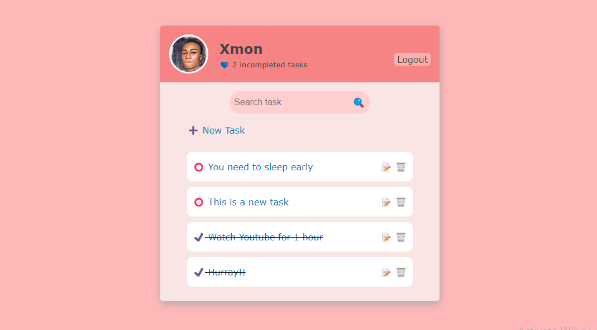

# Django based To-Do



The best project to help learn a new development framework is a `To-Do` application.
It helps to practice the **CRUD** operations:

- _C_ -> create an item
- _R_ -> read/view the item
- _U_ -> update the item
- _D_ -> delete the item

---

## Project overview

In this project, the following features are implemented

#### AUTHENTICATION

> - create user account (`Register`)
> - login/sign-in with username and password validation

#### TO-DO OPERATIONS

> - create a to-do item
> - update the to-do item (item has title and description)
> - view to-do app
> - delete to-do (multiple deletion allowed)

---

# THINKING ABOUT CLONING THIS APP 🤔?...

1. Clone repository

```
git clone https://github.com/esmond-adjei/django-todo-app
```

2. Change directory to codebase (directory that has `manage.py`)

```
cd django-todo-app
```

3. Install requirements for the app (use `pip` for Windows)

```
pip3 install -r requirements.txt
```

4. Start django server (use `python` for Windows)

```
python3 manage.py runserver
```

5. Login with this credential

```
username: xmon
password: iamesmond
// 😀 It doesn't matter, you're not esmond.
```
